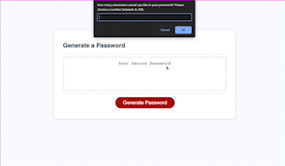

# password-generator
Coding Bootcamp Challenge #3 - JavaScript

## Description

Using the starter code provided, I wrote the JavaScript to generate a password for the user. The generator prompts the user through the length and different characters to give them a password that meets their requirements. The code includes:

- Prompts for lower/uppercase letters, numbers, and special characters. 
- Verification checks that the length entered fits within the minimum (8) and maximum (128). 
- Verification that the entered value is a number. 
- Guaranteed usage of at least one character from every selected array. 

Before this project, I was able to understand the various components of JavaScript but had difficulty seeing how they all interacted together. This project helped me to see how each of lessons worked as part of a whole and the variety of ways elements, functions, variables, methods, etc. could be combined to achieve the desired effect.   

## Installation

NA

## Usage

This application is for potential employers and fellow developers to view my work and get a secure password if they need it!

https://ecussler.github.io/hello-im-elena/

## Credits

Credit to the starter code from friendlyparakeet: https://github.com/coding-boot-camp/friendly-parakeet

Credit to my tutor, Mila Hose, for helping me walk through my thought processes and apply them to JavaScript.  

## License

Please refer to the LICENSE in the repo. 
